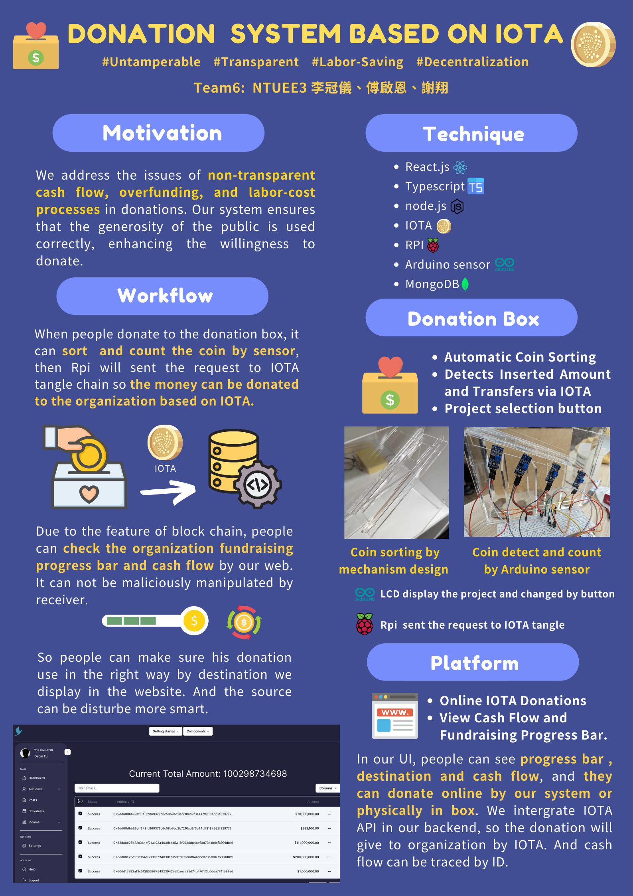

# IOTA_Donation_box
## Overview


## Requirements
Make sure you have Node.js and Yarn installed.

## Setup

### 1. Backend

1. Navigate to the backend directory:
    ```sh
    cd backend
    ```

2. Install the required dependencies:
    ```sh
    yarn install
    ```

3. Start the backend service:
    ```sh
    yarn start
    ```

### 2. Frontend

1. Install the required dependencies:
    ```sh
    yarn install
    ```

2. Start the frontend service:
    ```sh
    yarn start
    ```

## Environment Variables
Make sure to set the necessary environment variables. You can create a `.env` file in the `backend` directory

## Notes

- Once both the frontend and backend services are running, you can visit the frontend service in your browser (usually at `http://localhost:3000`) to view the website.
- Ensure the backend service is connected to the correct MongoDB database when it starts.

## Development Environment

- Node.js: v14.x or higher
- Yarn: v1.22.x or higher

## Technologies Used

- Frontend: React
- Backend: Node.js, Express
- Database: MongoDB

## Support

If you have any questions, please contact the project manager or submit an issue to the GitHub repository.


